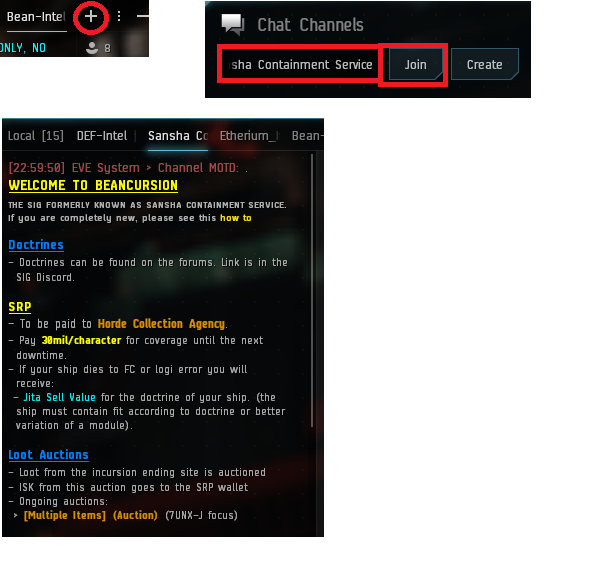

# New-Bro Guide

---

## Requirements

Beancursion uses a progress system for pilots, Starter, Basic, Elite & Elite Gold are the different tiers you can achieve on your ship specific skills. You can see your current skill tiers for each ship on the [Skill Page](/skills). The actual level of your skill is displayed on the left, while the next tier level is displayed on the right.

The [upgrade policy](/guide/upgrade) is there to encourage you upgrading your ship. Those ship are use also in PvP Doctrine, so you want waste skill point training those doctrine. 

### DPS

To get started in Beancursion all you need is to be able to **online ALL modules on your ship**, and have the **four armor compensation skills at level 2 for starter fits & 4+ for everything else**. The **starter skills** are the skills you should focus on when you start flying.  Upgrading is highly encouraged.

### LOGI

To fly logi with TDF you will need **basic tier skills as a minimum**, you also need to be able to **fully online all modules on your ship**. Any red starter skills must be trained before you can fly logi.

More logi specific requirements and guidance can be found in the [Logi guide](/guide/logi).

## Joining SCS's Channel

To find us in-game; join the chat channel **Sansha Containment Service**. You can do this by clicking the little plus button where your chat window is at the top. Then in the channels box type Sansha Containment Service and then click join.

## Reloading MOTD

Message Of The Day (MOTD) is where you will find the most up to date information on all aspects of TDF. If you need to reload the MOTD left click the cog wheel in the top left corner of the chat window then left click "Reload MOTD." Read the MOTD every time you join the channel it will answer most common questions.

## Fittings

To find out our current doctrine please join our fitting mailing lists or use the [Fits Page](/fits). The fittings on the fit page will sometimes have icons on them, these denote exceptions or requirements specific to that fit, you can find the details by clicking the fit and reading the note at the bottom.

## Ship Settings

**Alarms:** While out in space also make sure your shield/armor/hull alarms are turned on and set to 95%. You do this by clicking on the hamburger menu to the bottom right of your HUD and then click the configure ship health alerts.

**Drones:** Lastly; while in space click the cog button on the "Drones in Space" bar of the drone window. Untick "Auto Attack" and set your drones to focus fire.

## Interface Settings

**Overview Settings:** Fleet uses tagging to focus fire from all pilots onto a single enemy. Your overview should have at a minimum the tag column enabled. To see the overview window you must be in space. Click the hamburger in the top left of the overview window and open the overview settings. In the column tab enable the tag column in the overview. The presets tab is used to add or remove object groups showing in your overview.

**Broadcast Settings:** The last thing to do is setup your broadcasts.

Open the fleet window and then click form fleet. Then clicking the chevrons bottom right will pop up the broadcast buttons. Make sure there’s a cross in the bottom right hand corner with arrows pointing in all four directions, this indicates that you will broadcast to everyone in fleet.

Next click the hamburger menu and go to broadcast settings. From here choose some colours for your broadcasts so you can easily differentiate them. If you are not logi the most important broadcasts for you to see are "Align To" and "Warp To."

Last but not least, select the history tab in the fleet window and select "Broadcast History" from the Filters drop down list. This setting will only display broadcasts from the fleet and ignores any loot/member history.

## Keep reading

[First Fleet guide](/guide/xup)
